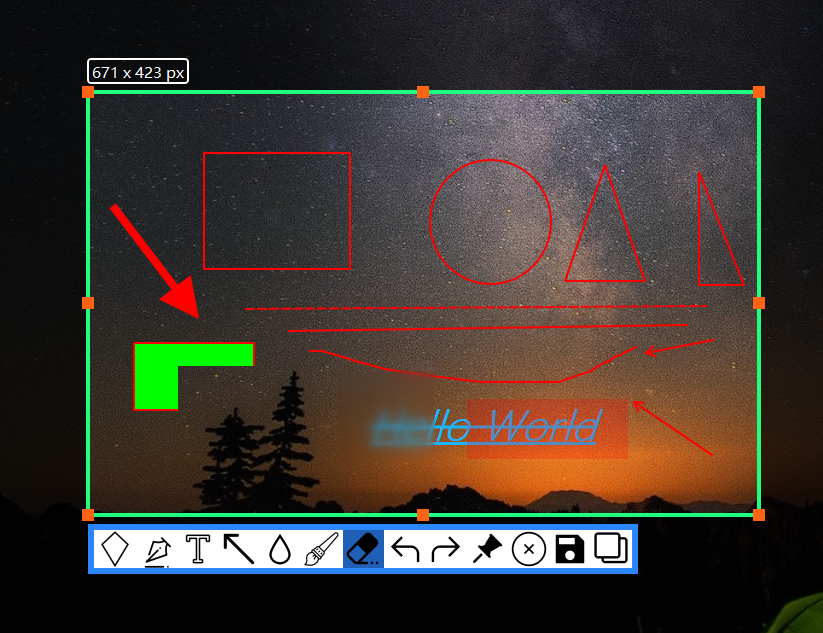
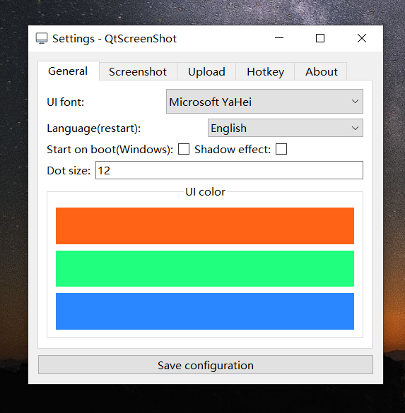

# QtScreenShot
The QtScreenShot was written by Qt and UI design referenced from Snipaste and Flameshot (because I use snipaste on Windows :)). There is also some code referenced from these projects, so thanks to those who contributed to the open source here!

### Clone repository
Linux:
```bash
git clone https://github.com/josexy/QtScreenShot.git --recursive
cd QtScreenShot
```
Windows:
Please use Github Desktop

### Compile & Install QHotkey library
QHotkey is a cross-platform global hotkey library, and you must have compiled the QHotkey library before you can compile QtScreenShot.

```bash
cd QHotkey
qmake
make
make install
cd ..
```

### QtScreenShot
```bash
qmake
make
cd bin
./QtScreenShot
```
On Linux, if you are running the QScreenShot binary directly from a terminal without the QHotkey library installed, you need to execute the command `export LD_LIBRARY_PATH=$LD_LIBRARY_PATH:. /` and have copied the required QHotkey libraries (e.g. libQHotkey.so*) to the directory where the executable file is located, before you can run QScreenShot successfully.
It's similar on Windows, but you just need to copy the link library to the directory where the executable file is located. That's easy.

### Need
- Python with requests library(Upload image)
- QHotkey library(Global hotkey)
- Smms account(Image Server)
- Proxy(Optional)

### Screenshot Example






